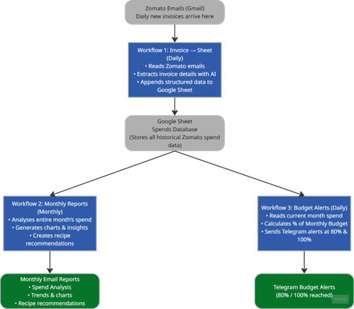
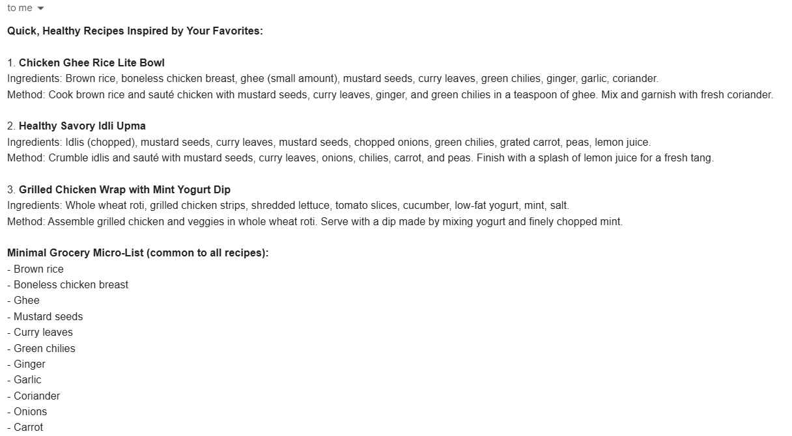

# Zomato Spend Analyzer  
### Automated spend tracking, monthly insights, and real-time budget alerts using n8n + AI
This project is an end-to-end automation system built with **n8n**, **LLMs**, **Google Sheets**, and **Telegram** that helps you understand and manage your Zomato spending effortlessly.
It reads your invoices, structures the data, generates analytics, emails monthly summaries, and alerts you when you cross your budget — completely on autopilot.

##  Features

### 1. Automated Invoice Parsing (Daily)
- Reads Zomato order confirmation emails  
- Uses an LLM to extract spend data  
- Normalizes values (order amount, date, restaurant, items, etc.)  
- Appends data into a Google Sheet  

### 2. Monthly Spend Analytics (Monthly)
Generates a full monthly report with:
- Total spend  
- Weekly breakdown  
- Restaurant frequency  
- Day-of-week patterns  
- Charts (via QuickChart API)

### 3. AI Recipe Recommendations (Monthly)
Based on your **most ordered dishes** during the month, the workflow:
- Suggests healthy recipe alternatives  
- Generates grocery lists  
- Sends a second monthly email with actionable recommendations  

### 4. Budget Alerts (Daily)
Reads cumulative monthly spend from your sheet and:
- Sends a Telegram alert at **80% budget reached**  
- Sends another alert when **100% budget is hit**

Fully automated, no manual checks required.

## Architecture Overview
See the full diagram here - 

## Workflows

### 1. Invoice → Sheet (Daily)  
`workflows/zomato-email-to-sheet.json`

Processes daily emails and appends clean structured invoice data into Google Sheets.

### 2. Monthly Report & Recipes (Monthly)  
'workflows/zomato-monthly-report-&-recipes.json'
Runs once a month to generate:
- Spend analysis email  
- Recipe recommendation email  
Includes charts + AI-generated insights.

### 3. Budget Alerts (Daily)  
'workflows/zomato-budget-alerts.json'

Monitors spend progression and pushes Telegram notifications at key thresholds.

## Docs & Screenshots
- **Monthly Spend Summary Email** →  
- **Recipe Recommendations Email** →  

## Tech Stack
- **n8n** (automation & workflow engine)  
- **OpenAI / LLMs** (invoice parsing, recipe generation)  
- **Google Sheets** (data storage)  
- **QuickChart API** (chart generation)  
- **Telegram Bot API** (budget alerts)  

## Setup Instructions
1. Import workflows from the `/workflows` directory  
2. Create environment credentials for:  
   - Gmail trigger  
   - Google Sheets  
   - Telegram Bot  
   - OpenAI API  
3. Set your monthly budget directly in the Google Sheet  
4. Enable triggers & deploy the workflows  

## Why I Built This
I wanted a simple way to track my food delivery spending without opening the app or scanning invoices manually. This project started as a personal experiment and evolved into a complete, automated system that now sends me insights, alerts, and even healthier recipe alternatives every month.

## Future Enhancements
- Add support for Swiggy  
- Add daily/weekly dashboards  
- Connect data to Notion  
- Generate spend forecasts
  
## License  
MIT License — free to use, modify, and share.
